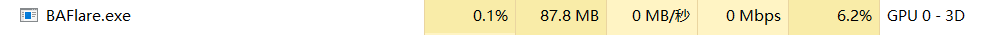
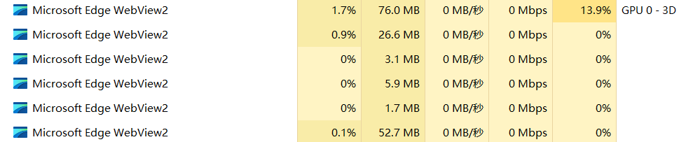

# BAFlare
A lightweight, native Windows mouse effect tool that reconstructs the Blue Archive UI style using C, SDL2, and Modern OpenGL.WITHOUT WebView; Inspired by BASpark

WebVer: https://baf.quoex.moe/ You can add the same effect to your own site by including:

``

如果你喜欢这个项目请送个STAR吧谢谢la

* This software is not an official work of Blue Archive. The visual style is inspired by Nexon/Yostar's Blue Archive. The relevant copyrights belong to the original authors. Any presets in this project related to similar style particle effects respect and comply with the official secondary creation requirements of the original creators and are non-profit. This software is independently developed and does not incorporate any resource files or code from the official version of Blue Archive. The code used in this repository, such as the rendering pipeline, is licensed under the MIT License. However, any distribution that violates the official secondary creation requirements of Nexon/Yostar's Blue Archive, such as for profit or damaging the image of the relevant parties, involving copyright infringement, is not related to the author of this project. This project only provides a basic framework for mouse effects under the MIT License.

## Overview
**BAFlare** is a high-performance rewrite of the original [BASpark](https://github.com/DoomVoss/BASpark).
The original version used a "WPF + WebView2" architecture. While effective, it relied on Webview. This project replaces that stack entirely with a pure **C / SDL2 / OpenGL 3.3 Core** implementation.(And a LVGL GUI) 
### Key Changes
*   **No WebView**: Removes the dependency on the Edge/WebView2 runtime.
*   **Native Performance**: Utilizes a custom Batch Renderer and modern OpenGL shaders for rendering, resulting in lower memory usage and faster startup.
*   **GPU Optimized**: Implements VBO/VAO streaming and vertex compression techniques.
## Features
*   **Blue Archive Style**: Recreates the iconic click sparks, shockwaves, and movement trails.
*   **Lightweight**: Minimal CPU and GPU usage when idle.
*   **Custom Color Palette**: A versatile color palette allowing you to freely customize and match the colors of all special effects.
## Requirements
*   **OS**: Windows 10 / 11
*   **Architecture**: x64
*   **Graphics**: OpenGL 3.3 support
## 小巧思
*   默认对隐藏光标的状态隐藏特效，游戏例如 Minecraft 无需（其实暂时无法）设置白名单即可完美使用。
*   极低 CPU 占用 极低 RAM 占用 388KB的主程序体积
*   休眠空闲时减缓刷新裁剪工作集，约 0% CPU 占用 2MB内存占用
*   尽量(更原版的粒子特效)
*   无需安装，随意存放在一个角落，通过配置程序设置开机启动即可
实际上体感差距和 BASpark 差距不大，特别是你的电脑比较强劲的情况下，事实上很大一部分消耗集中在Windows窗口管理器的透明叠加上，不过我正在尝试解决。
配套设施没有特别丰富，因此再次推荐原项目 [BASpark](https://github.com/DoomVoss/BASpark)。
*   由于置顶穿透窗口和鼠标监听，可能被杀毒软件误报，已在360上报，监测结果见images下的图片。你也可以选择自行构建。

附上13thGen i7-1360P/核显笔记本/3cps/60fps下的任务管理器对比
BAFlare:

原版WebView

## Credits & License
*   Inspired by the original [BASpark](https://github.com/DoomVoss/BASpark).
*   Visual style based on *Blue Archive* (Nexon / Yostar).
*   Licensed under the **MIT License**.
## More settings...

