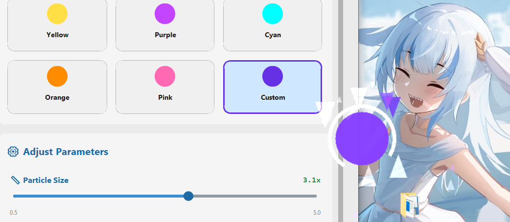
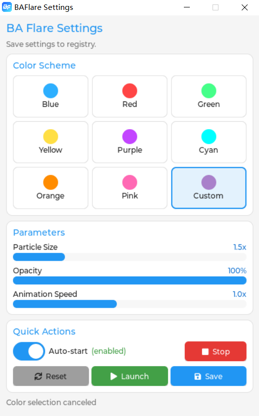

# BAFlare
A lightweight, native Windows mouse effect tool that reconstructs the Blue Archive UI style using C, SDL2, and Modern OpenGL.WITHOUT WebView; Inspired by BASpark

WebVer: https://baf.quoex.moe/ You can add the same effect to your own site by including:

``

# 本项目已被归档：
* 程序的目前状态已经完全满足了作者本人日常使用和审美要求(虽然和原版不完全相同但我认为足够实用)
* 这个项目和我的专业方向没有任何关系，我并没有精力维护
* CialloKing/ba-click-fx是一个"逐参数移植"的项目，如果你想要还原可以看看
* 虽然如此但未来我仍然可能以此为基础创建新的光标特效，如“Quoexyz/PhiFlare”

* This software is not an official work of Blue Archive. The visual style is inspired by Nexon/Yostar's Blue Archive. The relevant copyrights belong to the original authors. Any presets in this project related to similar style particle effects respect and comply with the official secondary creation requirements of the original creators and are non-profit. This software is independently developed and does not incorporate any resource files or code from the official version of Blue Archive. The code used in this repository, such as the rendering pipeline, is licensed under the MIT License. However, any distribution that violates the official secondary creation requirements of Nexon/Yostar's Blue Archive, such as for profit or damaging the image of the relevant parties, involving copyright infringement, is not related to the author of this project. This project only provides a basic framework for mouse effects under the MIT License.
* If you are a rights holder and believe that any aspect of this project infringes upon your intellectual property rights, please contact “jdfx54@gmail.com” with relevant evidence. The author commits to reviewing and, if appropriate, removing or modifying the disputed content within a reasonable timeframe.
## Overview
**BAFlare** is a high-performance rewrite of the original [BASpark](https://github.com/DoomVoss/BASpark).
This project uses **C / SDL2 / OpenGL 3.3 Core**.(And a LVGL GUI) 
## Credits & License
*   Inspired by the original [BASpark](https://github.com/DoomVoss/BASpark).
*   Visual STYLE inspired by *Blue Archive* (Nexon / Yostar).
*   Licensed under the **MIT License**.
## More settings...

